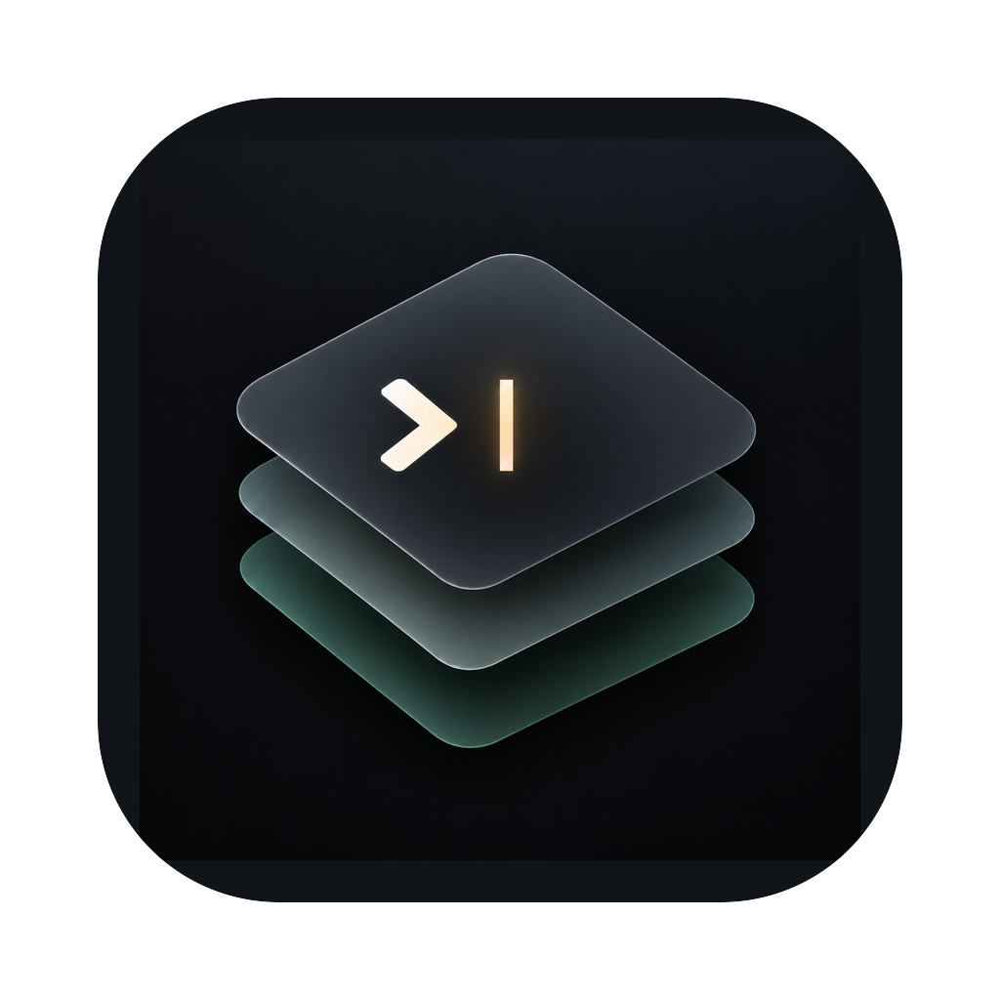

<p align="center">
  
</p>

<h1 align="center">Jelly</h1>

<p align="center">A native macOS terminal built on Liquid Glass.</p>

<p align="center">
  <a href="https://github.com/jelly-terminal/jelly/actions"></a>
  
  
</p>

<p align="center">
  
</p>

## What is Jelly

Jelly is a SwiftUI + AppKit terminal for macOS 26 and later. It renders through SwiftTerm's Metal engine, wraps everything in Liquid Glass chrome, and organizes your shells into named **sessions** of tabs and split panes instead of a pile of unnamed windows. Config is plain TOML, updates ship through Sparkle, and there's no Electron or web view anywhere in the stack.

See [`docs/product.md`](docs/product.md) for the full tour, including window anatomy, keyboard shortcuts, and configuration.

## Goals

- **Fast** — GPU-rendered, idle at 0% CPU, no dropped frames under heavy output.
- **Compatible** — your shell, prompt, and font render exactly as they do in Ghostty or iTerm2.
- **Organized** — sessions and projects replace unnamed windows.
- **Configurable in plain text** — one `jelly.toml` for settings and themes.
- **Native** — SwiftUI and AppKit, not a web view.

## Install

Jelly isn't distributed outside this repo yet. Build it from source below, or grab a release from [Releases](https://github.com/jelly-terminal/jelly/releases) once one exists.

## Build from source

Requires Xcode 26+ on macOS 26+.

```sh
git clone git@github.com:jelly-terminal/jelly.git
cd jelly
make debug   # build Debug and open "Jelly (Debug)"
```

Other targets:

```sh
make build   # build Debug
make prod    # build Release and open
make test    # swift test in both packages
make kill    # stop running Jelly processes
make clean   # remove the derived data directory
```

## Project layout

```
Jelly/                  App target: App/, Features/<Feature>/, Resources/
Packages/JellyCore/      Config, themes, workspace model, persistence. No UI.
Packages/JellyTerminal/  TerminalSurface (SwiftTerm), shell launch, fonts.
Config/                  Info.plist extras (Sparkle), entitlements
docs/                    Product, architecture, config, release, roadmap
```

Dependencies only flow one way: App → JellyTerminal → JellyCore.

## Documentation

- [`docs/product.md`](docs/product.md) — what Jelly does and how it looks
- [`docs/tech.md`](docs/tech.md) — architecture, layout, engine, fonts, renderer, testing scope
- [`docs/config.md`](docs/config.md) — `jelly.toml` format and every key
- [`docs/release.md`](docs/release.md) — signing, notarization, Sparkle, CI
- [`docs/roadmap.md`](docs/roadmap.md) — what's in which version

## Contributing

See [`CONTRIBUTING.md`](CONTRIBUTING.md).
